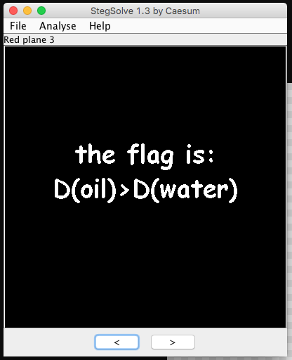

# Keith and Dawg 1

### Challenge
> Keith walked into the dark alley, nervously turning around to make sure he wasn't being followed by anyone. It was already his fourth day on the job, but he was still extremely paranoid about being caught by the police. Steadying his shaking hands, he opened a door, and stepped into an even darker room. He closed the door behind him. A short blond man with a distinctly German accent stepped out of the shadows and into the dim light. "You're late." Keith panicked. "S...s...sorry." "Get to work." The short man gruffly turned around and disappeared back into the shadows. Keith finally relaxed. He walked to a computer, sat down, and began another day of tedious IT work. Keith had a sneaking suspicion that the people he was working for were not the most reputable, but he needed the money so he decided to keep his head down and focus only on his job. Somewhere around noon, several hours later, Keith rubbed his eyes and sat back, relaxing for a few minutes. Keith wondered who the short blond man was. He knew his name was Shady J Dawg, and he was some sort of manager around here, but Keith didn't even know what this place was, or what the other people here did. He was only told exactly what he needed in order to complete his menial task, nothing more. He couldn't stand the boredom, and curiosity eventually got the better of him. Keith quickly looked around and made sure no one was watching, then started poking around the other files on the computer. On his first day, Degen had instructed him not to look at anything he wasn't specifically told to look at, but Keith couldn't resist his curiosity anymore. He found a folder marked "Shady J Dawg", and opened it. There were only two files inside: "k&d0.png" and "k&d0.7z". "What could these possibly be?" Keith wondered. He pulled out a flash drive and quickly copied the two files. Before he could inspect any further, a voice with a distinct German accent called out from the shadows, "What do you think you're doing?!" Keith spun around. The short blond man stepped out of the shadows looking absolutely livid. "I told you not to be too nosy, but you didn't listen." "This is very bad," Keith thought. He quickly grabbed the flash drive and ran out. J Dawg chased after him, but Keith was too fast. Keith darted out the door, back through the alley, and didn't stop running until he reached his home and locked the door behind him. Keith sat down at his computer and plugged in the flash drive. He tried to open the "k&d0.7z" file, but it appeared locked. "Hmmm," he thought. "The password must be somewhere hidden in the [other file](k_d0.png)." Find the password. To be continued... 

### Solution
In short, the password is hidden in [the png file](k_d0.png).
Opening it, it is a completely transparent image, it must be something related to Stegnography.

Use [StegSolve by Caesum](http://www.caesum.com/handbook/Stegsolve.jar) and at Red plane 3, we see this:

The flag is `D(oil)>D(water)`